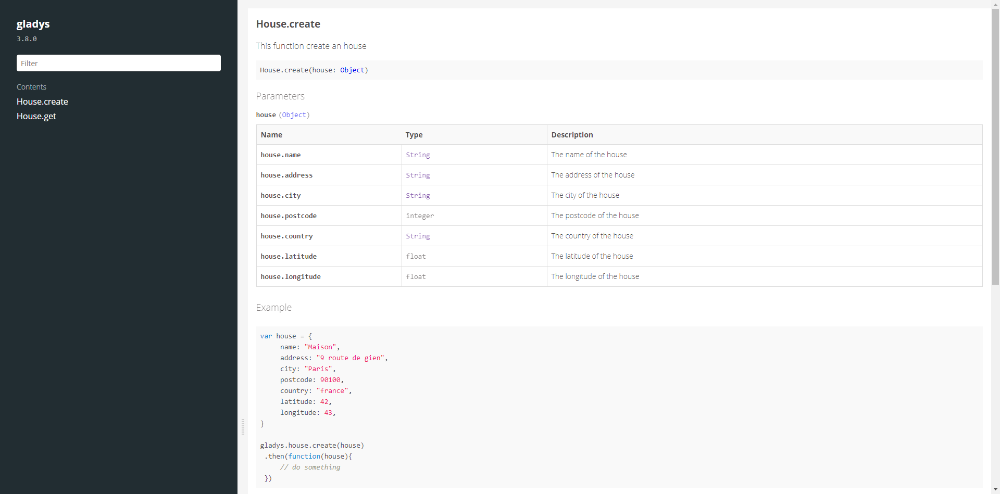

## Flat Theme for documentation.js

This is a theme for [documentationjs](https://github.com/documentationjs/documentation).



### Usage

```
$ npm install --save-dev documentation-flat-theme
$ npm install -g documentation
```

Then use the theme to build your docs:

    $ documentation serve --format html --theme node_modules/documentation-flat-theme

### Development

To build:

    $ npm run build

To build and watch:

    $ npm run watch
	
### Sources

This theme is based on [documentation-devseed-theme](https://github.com/developmentseed/documentation-devseed-theme.git)

